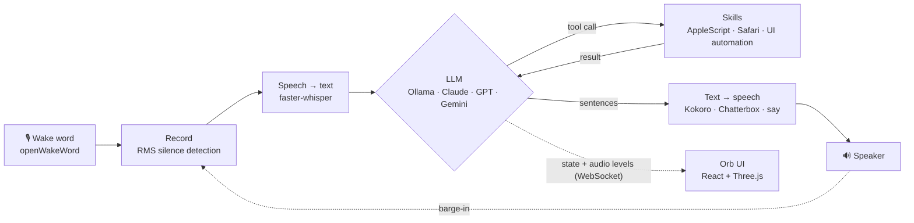

# jarvis

A local-first voice assistant for macOS. Say "Hey Jarvis", ask for something, and it transcribes you, reasons with an LLM, **calls tools that act on the machine**, and answers out loud. Speech-to-text, the LLM, and text-to-speech all run locally, on a Mac Mini M4 with 16 GB of RAM.

The voice is the demo. What I actually built is the agent loop: **hear → reason → act → answer**, with each stage swappable behind a small interface.



## What it does

- **Wake word and conversation mode.** Listens for "Hey Jarvis", then stays in the conversation, keeping the last 20 messages as history. It goes back to sleep after 30 s of quiet or when you say something like "never mind" or "go to sleep".
- **Tool calling that actually does things.** 14 skills are discovered automatically from `skills/`. Each is a class with a name, a description, and a JSON Schema for its arguments. The LLM sees them as tools, so it can open apps, set the volume, control Apple Music, read and write the clipboard, search the web, search your own files, drive Safari, find contacts and start calls, open System Settings, and install from the App Store.
- **Generic UI automation.** `ui_read` reads the accessibility tree of whatever app is in front, and `ui_click` and `ui_type` act on it. The system prompt tells the model to read before it clicks, so it can work its way through app screens it has never seen.
- **Streaming speech.** The LLM's reply is split into sentences as it streams. Each sentence goes to text-to-speech right away, so Jarvis starts talking before the model has finished its answer.
- **Barge-in in two phases.** While Jarvis is speaking, a microphone monitor listens for speech above a higher threshold, so the speaker's own output doesn't trigger it. When you interrupt, playback stops and it keeps recording **on the same mic stream**, so your first words aren't lost.
- **Local file search.** A background indexer crawls `~/Documents`, `~/Desktop`, and `~/Downloads`. It extracts text from PDF, DOCX, PPTX, XLSX, and plain-text files, splits it into chunks, embeds them with `nomic-embed-text` through Ollama, and stores everything in SQLite. Search combines **FTS5 keyword matching with cosine similarity, merged by Reciprocal Rank Fusion**.
- **Orb UI.** A React + Three.js orb that changes its animation for idle, listening, thinking, acting, and speaking, based on live state and audio levels sent over a WebSocket. There's also a settings panel for switching providers and models at runtime, a chat input, and file search.
- **Phone voice.** A second WebSocket endpoint takes microphone audio from a phone browser (over HTTPS), sends it through the same pipeline, and streams the spoken reply back to the phone.
- **OpenAI-compatible audio API.** `openai_api.py` exposes `/v1/audio/speech` and `/v1/audio/transcriptions`, so Open WebUI and other OpenAI clients can use local Kokoro and Whisper instead of paid APIs.

## Built to fit in 16 GB

Every design choice here follows from the memory limit:

| Component | Memory |
|---|---|
| macOS + Python | ~3 GB |
| Ollama · Llama 3.1 8B | ~5 GB |
| Kokoro TTS (when loaded) | ~4.5 GB |
| Whisper base (int8) | ~0.5 GB |
| **Headroom** | **~2 GB** |

That's why the TTS model loads the first time it's used and **unloads after 5 minutes idle**, why Whisper runs in int8, and why the default LLM is an 8B model. The full reasoning is in [docs/jarvis-build-story.md](docs/jarvis-build-story.md).

## Swappable components

Each stage is picked from `config.py` and can be changed at runtime from the settings panel (saved to `~/.jarvis/settings.json`):

| Stage | Options | Default |
|---|---|---|
| LLM | `ollama`, `anthropic`, `openai`, `gemini` | Ollama · `llama3.1:8b` |
| Text-to-speech | `kokoro` (~50–200 ms), `chatterbox` (highest quality, slow), `macos` (`say`, no dependencies) | Kokoro |
| Speech-to-text | faster-whisper | `base`, int8 |

Tools are defined once, in Ollama's format, and each provider converts them to its own tool-calling format. Adding a skill means dropping one class into `skills/`; adding a provider means writing one module in `llm_providers/`.

## Running it

**Requirements:** macOS (the skills use AppleScript and the accessibility APIs), Python 3.11, [Ollama](https://ollama.com), `ffmpeg`, and PortAudio.

```bash
brew install portaudio ffmpeg
ollama pull llama3.1:8b
ollama pull nomic-embed-text

python3.11 -m venv venv && source venv/bin/activate
pip install fastapi uvicorn pyaudio numpy requests faster-whisper openwakeword kokoro \
            pypdf python-docx python-pptx openpyxl
# optional: anthropic openai google-genai (cloud LLMs) · chatterbox-tts (high-quality TTS)

cd frontend && npm install && npm run build && cd ..   # built UI is served by FastAPI
uvicorn main:app                                        # http://localhost:8000
```

Cloud providers read `ANTHROPIC_API_KEY`, `OPENAI_API_KEY`, or `GEMINI_API_KEY` from the environment, or you can enter them in the settings panel. To use the phone voice client, put a self-signed cert in `certs/` (it's git-ignored) and start with `python run.py`, which serves HTTPS on `0.0.0.0:8000`.

[docs/quick-reference.md](docs/quick-reference.md) lists the voice commands, every config setting, and the API endpoints.

## Layout

```
main.py            FastAPI app — REST, WebSockets, starts the voice loop + indexer
voice.py           the loop: wake word → record → STT → LLM → TTS, with barge-in
llm.py             provider dispatch, sentence streaming, tool-call loop
stt.py · tts.py    speech in / speech out, lazy-loaded backends
wake_word.py       openWakeWord "hey_jarvis"
skills/            auto-discovered tools the LLM can call
llm_providers/     Ollama · Anthropic · OpenAI · Gemini
tts_backends/      Kokoro · Chatterbox · macOS say
indexer/           crawl → parse → chunk → embed → SQLite (FTS5 + vectors)
web_voice.py       phone-mic WebSocket pipeline
openai_api.py      OpenAI-compatible /v1/audio endpoints
frontend/          React + Three.js orb UI
```

## Status

This is a personal build and a working proof of the agent loop, not a product. It runs day to day on my Mac Mini. Only the local speech-to-text backend is implemented, and the skills are macOS-only.
